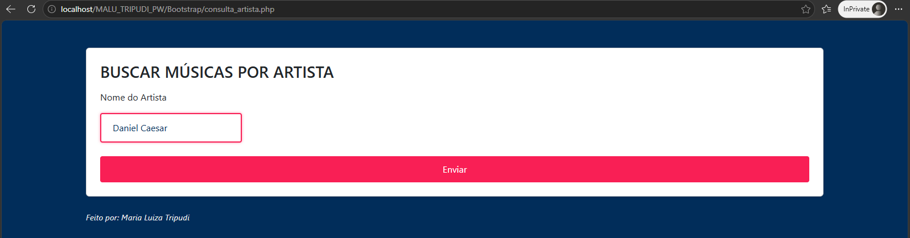

# 🎵 Music Finder - Consulta de Músicas via API iTunes

Uma aplicação web moderna e responsiva construída em **PHP**, **Bootstrap 5** e **CSS3**, que consome a API pública do iTunes para buscar faixas, álbuns, informações detalhadas e executar prévias de áudio de 30 segundos com um player customizado.

---

## 📸 Demonstração

| Tela de Busca | Resultados da Pesquisa |
| :---: | :---: |
|  |  |

---

## ✨ Funcionalidades

- **Busca por Artista:** Integração direta com a API da Apple (iTunes Search API).
- **Player de Áudio Customizado:** Player estilizado com JavaScript para reproduzir prévias de áudio de 30 segundos, incluindo controle de progresso e pausamento automático de outras faixas.
- **Capas em Alta Resolução:** Tratamento dinâmico das imagens retornadas da API para exibir capas de álbuns em qualidade HD (600x600px).
- **Interface Responsiva & Dark Theme:** Layout construído com Bootstrap 5 e CSS3 personalizado, com suporte completo a dispositivos móveis, tablets e desktops.

---

## 🛠️ Tecnologias Utilizadas

- **PHP 8.x:** Processamento no servidor e consumo de API externa.
- **Bootstrap 5:** Sistema de grid, cards e layout responsivo.
- **HTML5 & CSS3:** Estruturação e estilização customizada (Dark Theme em tom de azul escuro e detalhes em rosa néon).
- **JavaScript (Vanilla):** Lógica interativa do player de áudio e manipulação da barra de progresso.
- **API do iTunes:** Endpoint público para consulta de faixas e áudios.

---

## 🚀 Como Executar o Projeto

1. **Requisitos:**
   - Servidor web local (como XAMPP, WAMP ou Laragon) com PHP instalado.

2. **Passos:**
   - Clone este repositório ou baixe os arquivos em seu ambiente local:
     ```bash
     git clone [https://github.com/seu-usuario/nome-do-repositorio.git](https://github.com/seu-usuario/nome-do-repositorio.git)
     ```
   - Mova a pasta do projeto para o diretório raiz do seu servidor local (ex: `htdocs` no XAMPP).
   - Inicie os serviços de Apache no painel do servidor.
   - Acesse no navegador:
     ```text
     http://localhost/nome-da-sua-pasta/consulta_artista.php
     ```

---

## 📂 Estrutura de Arquivos

```text
├── consulta_artista.php  # Formulário principal de busca
├── lista_musicas.php     # Processamento da API e exibição dos cards
├── style.css             # Estilização customizada e overrides do Bootstrap
├── Tela1.png             # Screenshot da página inicial
└── Tela2.jpg             # Screenshot da página de resultados
